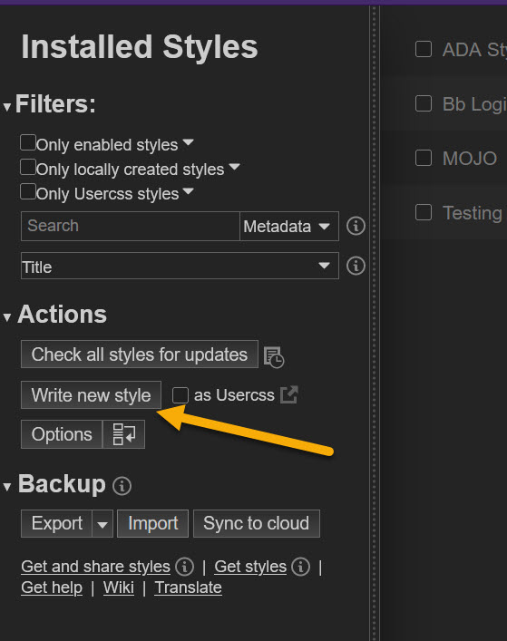

# Bb-Admin-Header-Colorize
 Colorize the header in the Administrator Panel within Blackboard Learn

 With Blackboard's new Ultra navigation I found it difficult to tell in the Administrator Panel which environment I'm in. I've created some custom user CSS which gives me visual cues to let me know which instance I'm working in. :joy:

**Administrator Panel Before**
 

**Administrator Panel After**
 

 ## Requirements

You will need to install the Stylus extension which is part or the Openstyles GitHub [Link](https://github.com/openstyles/stylus)

- Google Chrome: [Link](https://chrome.google.com/webstore/detail/stylus/clngdbkpkpeebahjckkjfobafhncgmne?hl=en)
- Mozilla Firefox: [Link](https://addons.mozilla.org/en-US/firefox/addon/styl-us/)

 ## Steps to Install

Once installed you will need to click on the Stylus icon in the browser, then click Manage.

The Stylus extension will open. Now click on the **Write New Style** button under Actions in the left menu.

In the new style page, use the left area to provide a name for the style. I have used Blackboard Admin Headers in this example. Then click on **Import**.

Now copy and paste the code into the blank text box. *Make sure you have changed the URLS to point to your Blackboard instance(s)*

**Before**

**After**

Now click on **Overwrite Style**

Now click **Save**

